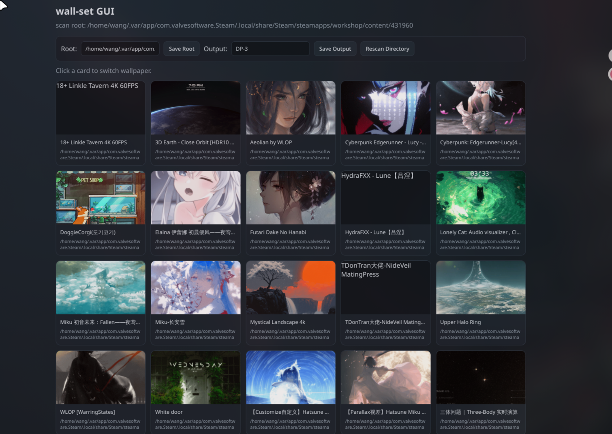

<div align="center">
  <h1>wall-set</h1>
  <p>一个面向 Wayland 的轻量壁纸管理器，支持图片、视频和 Wallpaper Engine 项目。</p>
  <p>
    <a href="README.md">English</a> ·
    <a href="docs/assets/gui-demo.mp4">演示视频</a>
  </p>
  <a href="docs/assets/gui-demo.mp4">
    
  </a>
</div>

`wall-set` 是一个面向 Linux Wayland 环境的轻量壁纸管理器，使用 Rust 编写。它提供本地 Web 界面来浏览壁纸库，图片壁纸通过 `swww` 应用，Wallpaper Engine 的视频和项目壁纸通过 `linux-wallpaperengine` 启动。

## 亮点

- 自带本地 Web GUI，支持壁纸网格浏览和侧边设置面板
- 同时支持静态图片、视频壁纸和 Wallpaper Engine 项目
- 启动时自动恢复上一次成功应用的壁纸
- 可保存每个 Wallpaper Engine 项目的属性覆盖值
- 可在界面中直接切换扫描目录和输出显示器
- 提供按壁纸单独控制的预览模糊开关，适合防旁观

## 功能特性

- 在 `127.0.0.1:7878` 提供本地 Web GUI
- 递归扫描可配置目录下的壁纸资源
- 支持图片、视频和 Wallpaper Engine 项目
- 记住上一次成功应用的壁纸，并在启动时恢复
- 支持命令行直接应用指定壁纸
- 可保存 Wallpaper Engine 项目的属性覆盖值
- 可在界面里修改扫描目录和输出显示器
- 可在 GUI 中对单张壁纸预览启用模糊保护

## 支持的资源类型

- 图片：`jpg`、`jpeg`、`png`、`bmp`、`gif`、`webp`
- 视频：`mp4`、`mkv`、`webm`、`mov`、`avi`、`m4v`
- Wallpaper Engine 项目：包含 `project.json` 的目录

## 运行依赖

- Linux + Wayland
- Rust 工具链
- [`swww`](https://github.com/LGFae/swww)，用于图片壁纸
- [`linux-wallpaperengine`](https://github.com/Almamu/linux-wallpaperengine)，用于视频和项目壁纸

程序默认从 `PATH` 中查找 `linux-wallpaperengine`。如果你的可执行文件不在默认路径里，可以通过 `LINUX_WALLPAPERENGINE_BIN` 指定。

## 构建

```bash
cargo build --release
sudo install -Dm755 target/release/wall-set /usr/local/bin/wall-set
```

## 使用方式

### Web 界面模式

启动内置服务：

```bash
wall-set
```

然后访问：

```text
http://127.0.0.1:7878
```

GUI 启动时会尝试恢复配置里记录的上一张壁纸。

### 命令行模式

直接应用壁纸：

```bash
wall-set /path/to/image.png
wall-set /path/to/video.mp4
wall-set /path/to/project-directory
```

恢复上一次壁纸：

```bash
wall-set restore
```

## 配置文件

配置文件默认位于：

```text
~/.config/wall-set/settings.conf
```

示例：

```ini
output=DP-3
root=/path/to/wallpapers
last=/path/to/wallpapers/example.png
prop=/path/to/project\tgod_rays\t0
```

字段说明：

- `output`：壁纸应用时使用的显示器输出名称
- `root`：Web 界面扫描的根目录
- `last`：最近一次成功应用的壁纸路径
- `prop`：Wallpaper Engine 项目属性覆盖值

## 环境变量

- `LINUX_WALLPAPERENGINE_BIN`：指定 Wallpaper Engine 可执行文件路径
- `WALL_SET_ENGINE_DEBUG=1`：输出引擎调试信息

## 自动启动说明

`autostart/` 目录里提供了登录后恢复壁纸和启动 GUI 的示例脚本。不过当前仓库中的 `.desktop` 文件和脚本包含类似 `/home/wang/hw/wall-set` 这样的本机绝对路径，换一台机器使用前需要先改成你自己的实际路径。

常见做法：

```bash
cp autostart/wall-set.desktop ~/.config/autostart/
cp autostart/wall-set-gui.desktop ~/.config/autostart/
```

## 项目结构

- `src/main.rs`：程序入口和模式分发
- `src/app/`：配置、状态和核心业务操作
- `src/fs/`：扫描根目录解析与壁纸发现
- `src/engine/`：壁纸引擎调用与项目属性处理
- `src/gui/`：本地 HTTP 服务和内置页面
- `autostart/`：自动启动脚本与桌面文件

## 当前定位

这个项目走的是轻量路线：不依赖完整 GUI 框架，而是使用自带 TCP/HTTP 服务和单页 HTML 界面，部署很直接，但也意味着它目前没有认证层、数据库，桌面集成主要依赖 `autostart/` 里的脚本。
